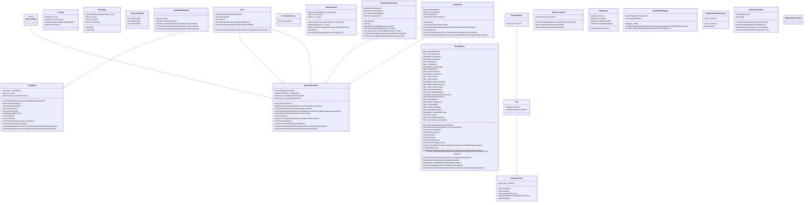

```mermaid
    classDiagram

    class Dice{
       +readonly ReactiveProperty<int> Number
       +bool IsAnswerBox
       +bool IsActive
       +readonly AsyncReactiveProperty<Dice> MergedDice
       +readonly AsyncReactiveProperty<bool> IsFinishedShuffle
       +UniTask ShuffleAsync(float shuffleLength,CancellationToken gameCt)
   }

    class DiceModel{
       -static Dice _answerDice
       -static List<Dice> _dices
       -static Formula _thisTimeFormula
       +UniTask ShuffleDicesAsync(CancellationToken gameCt)
       +int[] GetDiceNumbers()
       +int GetAnswerNumber()
       +Dice GetLastDice()
       +bool AnswerCheck()
       +void BackStep(Hist hist)
       +List<Dice> GetDices()
       +void PuzzleInit()
       +void SetDice(List<Dice> dices,Dice answerDice)
       +Formula GetThisTimeFormula()
       +void MergeDice(Dice one,Dice anotherOne,OperatorMark operatorMark)
       -int Calculation(Dice one,Dice anotherOne,OperatorMark operatorMark)
   }

    class Formula{
       +readonly int One
       +readonly int AnotherOne
       +readonly OperatorMark OperatorMark
       +readonly int Answer
   }

    class GameData{
       +static readonly ReactiveProperty<float> Timer
       +static int Score
       +static int Combo
       +static List<string> Solutions
       +void Win()
       +void Lose()
   }

    class GameInitialData{
       +int shuffleLength
       +int diceMaxValue
       +int numberOfDice
   }

    class GameStateManager{
       -void GameInit()
       -UniTask PuzzleFlowAsync()
       -UniTask CountTimerAsync(CancellationToken gameCt)
       -UniTask GameOveredAsync(CancellationToken gameCt)
       -UniTask GameClearedAsync(CancellationToken gameCt)
   }

    class GameUIPresenter{
       -GameUIView gameUIView
       -readonly Dictionary<OperatorMark,string> _operatorDic
       -Dictionary<Dice,NumberBox> _diceAndNumberBoxPairDic
       -Dictionary<NumberBox,Dice> _numberAndDicePairDic
       -string GetFormulaText()
       +bool[] CanCalculate(NumberBox one,NumberBox anotherOne)
       +UniTask RetireAsync(CancellationToken gameCt)
       +void Calculation(NumberBox one,NumberBox anotherOne,OperatorMark operatorMark)
       +string MakeFormulaText(Formula newFormula)
       +void PuzzleInit()
       +UniTask PuzzleBehaviorAsync(CancellationToken gameCt)
       +UniTask ShowNotice()
       +void SetFormulaText(string formulaText)
       +UniTask GameFinished(bool wasCleared,CancellationToken gameCt)
       +UniTask MoveToEqualAsync(CancellationToken gameCt)
   }

    class GameUIView{
       -Button backStepButton
       -TMP_Text solutionText
       +NumberBox answerBox
       -GameObject titlePanel
       +List<NumberBox> numberBoxes
       -Button retireButton
       -GameObject comboImage
       -Button restartButton
       -TMP_Text formulaText
       -GameObject noticePanel
       -TMP_Text scoreText
       -TMP_Text timeText
       -GameObject gameClearPanel
       -GameObject gameOverPanel
       -TMP_Text scoreResultText
       -TMP_Text timeResultText
       -TMP_Text comboResultText
       -List<Button> operatorButtons
       -UGUILineRenderer drawLine
       -Button settingButton
       -GameObject settingPanel
       -Slider diceMaxSlider
       -Slider diceAmountSlider
       -Button settingBackButton
       -GameObject numberBoxPrefab
       -Transform canvasT
       -TMP_Text diceMaxValueText
       -TMP_Text diceAmountValueText
       +void SetFormulaText(string formulaText)
       +void DrawLine(Vector2 position1,Vector2 position2)
       +string GetFormulaText()
       +void HideEverything()
       +void PuzzleInit()
       +void ClearLine()
       +UniTask ShowNotice()
       +void SetTimerText(float time)
       -UniTask ShowOperatorsAsync(bool[] canCalculate,CancellationToken gameCt)
       -void HideOperators()
       +UniTask<OperatorMark> SelectOperatorsAsync(bool[] canCalculate,CancellationToken gameCt)
       +UniTask GameFinishedAnimationAsync(bool wasGameCleared,CancellationToken gameCt)
       +UniTask RetireButtonOnClickAsync(CancellationToken gameCt)
       +IObservable<Unit> BackButtonOnClickAsObservable()
       +IObservable<Unit> SettingButtonOnClickAsObservable()
       +UniTask SettingProgress(CancellationToken gameCt)
       +UniTask MoveToEqualAsync(NumberBox numberBox,CancellationToken gameCt)
   }

    class DiceInfoClass{
       +(bool,int) DiceInfo
   }

    class FormulaInfoClass{
       +string FormulaText
   }

    class Hist{
       +readonly List<DiceInfoClass> Dices
       +readonly string FormulaText
   }

    class JamaicaHistory{
       -static Stack<Hist> _histories
       +void PuzzleInit()
       +Hist LastHist()
       +void SetInitHist(List<Dice> dices)
       +void SetHist(List<Dice> dices,string formulaText)
       +Hist BackHist()
   }

    class JamaicaSolver{
       -static readonly Stack<(int,string,int)[]> DiceHist
       -static readonly Dictionary<int,string> OperatorDic
       -static (int,string,int)[] _dices
       -static List<string> _solutions
       -static int _answer
       +(bool,List<string>) SolveJamaica(int answer,int[] diceNumbers)
       -void Solve()
       -(int,string,int)[] CopyArray((int,string,int)[] array)
   }

    class MouseInputProvider{
       -InputAction pressAction
       -InputAction releaseAction
       -bool _isMouseGettingDown
       +Vector2 mousePosition
       -void Initialize()
       -void Init()
       +void OnPress(CallbackContext context)
       +void OnRelease(CallbackContext context)
       +void GetMousePosition(CallbackContext context)
       +UniTask OnHoldDownAsync(CancellationToken gameCt)
       +UniTask OnHoldUpAsync(CancellationToken gameCt)
   }

    class NumberBox{
       +Vector2 initialPosition
       -TMP_Text numberText
       +bool isAnswerBox
       -CancellationToken destroyCt
       -void Awake()
       +void SetNumberText(int number)
       +UniTask FinishedShuffleAnimationAsync(CancellationToken gameCt)
       +void ShowBox()
       +UniTask HideBoxAsync(Vector2 destination,CancellationToken gameCt)
       +UniTask MoveToEqualAsync(Vector2 answerBoxPosition,CancellationToken gameCt)
   }

    class OperatorMark{
    <<enum>>
   }

    class PlayerController{
       -GameUIView gameUIView
       +UniTask PlayerBehavior(CancellationToken gameCt)
       -Vector2 AlignPosition(Vector2 position)
       -NumberBox GetHoveredNumberBox()
   }

    class PlayerData{
       +readonly int Score
       +readonly int Combo
       +readonly int NumberOfDice
       +readonly int DiceMaxNumber
       +void RegisterFormatter()
   }

    class PlayerDataManager{
       +static PlayerData PlayerData
       -const string FileName
       -string get_Path()
       +UniTask SavePlayerDataAsync(PlayerData playerData,CancellationToken gameCt)
       +UniTask LoadPlayerDataAsync(CancellationToken gameCt)
   }

    class SingletonMonoBehaviour{
       -static T instance
       +T get_Instance()
       #void Awake()
   }

    class UGUILineRenderer{
       +Vector2[] positions
       -float weight
       +void SetPositions(Vector2[] newPositions)
       #void OnPopulateMesh(VertexHelper vh)
       -void AddVert(VertexHelper vh,Vector2 pos)
       -Vector2 CalculateVerticalVector(Vector2 vec)
   }

    class PlayerDataFormatter{
   }
Dice --o DiceModel
OperatorMark --o GameUIPresenter
Dice --o GameUIPresenter
NumberBox --o GameUIPresenter
NumberBox --o GameUIPresenter
Dice --o GameUIPresenter
NumberBox --o GameUIView
DiceInfoClass --o Hist
Hist --o JamaicaHistory
```